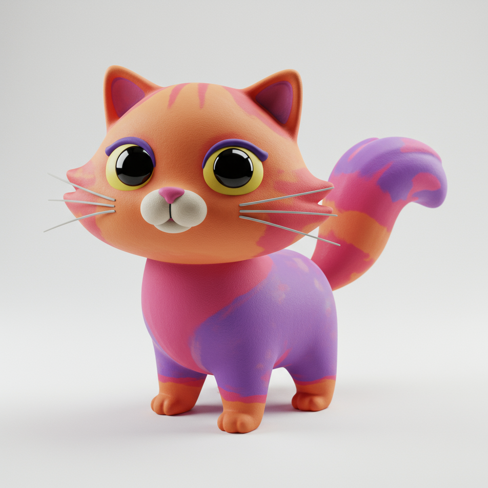

# Gemini Sculptor

A Deno-based Text-to-Clay agent using Google's Generative AI SDK (Gemini Imagen)
to generate stylized 3D cartoon props with playful clay-like textures.

## 🎨 Showcase

See what Gemini Sculptor can create! Here are some example generations:

<div align="center">

  

*Stylized 3D clay-like cartoon props generated with Imagen 4.0*

</div>

## Features

- **Text-to-Image Generation**: Create clay-like 3D cartoon props from text
  descriptions
- **Interactive CLI Mode**: Continuous session for multiple generations
- **Multiple Variations**: Generate multiple versions of the same concept
- **Custom Output Paths**: Specify custom file locations and directories
- **Model Selection**: Choose different Gemini models
- **Beautiful Spinners**: Visual feedback during generation
- **Comprehensive Help**: Built-in help system and examples

## Quick Start

### Prerequisites

1. **Deno**: Install from [deno.land](https://deno.land/)
2. **Google AI API Key**: Get from
   [Google AI Studio](https://makersuite.google.com/app/apikey)

### Setup

1. **Clone the repository**:
   ```bash
   git clone <your-repo-url>
   cd gemini-sculptor
   ```

2. **Set your API key**:
   ```bash
   # Windows (PowerShell)
   $env:GEMINI_API_KEY="your-api-key-here"

   # Windows (Command Prompt)
   set GEMINI_API_KEY=your-api-key-here

   # macOS/Linux
   export GEMINI_API_KEY="your-api-key-here"
   ```

3. **Run the agent**:
   ```bash
   # Generate a single image
   deno task start "cute robot with big eyes"

   # Start interactive mode
   deno task interactive
   ```

## Usage

### Single Command Mode

Generate clay images with a single command:

```bash
# Basic usage
deno task start "friendly dragon"

# Multiple variations
deno task start "space rocket" --variations 5

# Custom output path
deno task start "enchanted tree" --output ./my_creation.png

# Custom output directory
deno task start "magical castle" --output-dir ./my_creations

# Specify model
deno task start "cute robot" --model imagen-4.0-generate-001
```

### Interactive Mode

Start an interactive session for multiple generations:

```bash
# Basic interactive mode
deno task interactive

# With custom options
deno task start --interactive --output-dir ./my_creations --model imagen-4.0-generate-001
```

### Available Tasks

| Task          | Description                         | Example                         |
| ------------- | ----------------------------------- | ------------------------------- |
| `start`       | Generate images with arguments      | `deno task start "description"` |
| `interactive` | Start interactive mode              | `deno task interactive`         |
| `dev`         | Development mode with file watching | `deno task dev`                 |
| `help`        | Show help information               | `deno task help`                |
| `version`     | Show version information            | `deno task version`             |

### CLI Options

| Option          | Short | Description            | Example                           |
| --------------- | ----- | ---------------------- | --------------------------------- |
| `--interactive` | `-i`  | Start interactive mode | `--interactive`                   |
| `--variations`  | `-v`  | Number of variations   | `--variations 3`                  |
| `--output`      | `-o`  | Custom output path     | `--output ./image.png`            |
| `--output-dir`  |       | Output directory       | `--output-dir ./creations`        |
| `--model`       |       | Gemini model to use    | `--model imagen-4.0-generate-001` |
| `--help`        | `-h`  | Show help message      | `--help`                          |
| `--version`     | `-V`  | Show version info      | `--version`                       |

## 🎨 Image Generation

The agent generates stylized 3D cartoon props with:

- **Playful clay-like texture**
- **Smooth surface finish**
- **Modern and creative design**
- **White background with no shadows**
- **Soft studio lighting**
- **1:1 aspect ratio**

## 🔧 Interactive Mode Commands

When in interactive mode, you can use these commands:

- **`help`** - Show available commands
- **`clear`** - Clear the terminal
- **`quit`** or **`exit`** - End the session
- **`variations <count> <description>`** - Generate multiple variations

### Interactive Examples

```
🎨 Describe your clay creation: cute robot with big eyes
🎨 Describe your clay creation: variations 3 magical unicorn
🎨 Describe your clay creation: friendly dragon with rainbow scales
🎨 Describe your clay creation: help
🎨 Describe your clay creation: quit
```

## 🏗️ Project Structure

```
gemini-sculptor/
├── main.ts              # Main application file
├── deno.json            # Deno configuration and tasks
├── README.md            # This file
└── .gitignore           # Git ignore patterns
```

## 🛠️ Development

### Running in Development Mode

```bash
deno task dev
```

This will watch for file changes and automatically restart the application.

### Building and Testing

```bash
# Check for linting issues
deno lint

# Run type checking
deno check main.ts

# Run with specific permissions
deno run --allow-env --allow-net --allow-read --allow-write main.ts --help
```

## 📚 API Reference

### ClaySculptorAgent

Main class for generating clay images.

```typescript
const agent = new ClaySculptorAgent(apiKey);

// Generate single image
await agent.generateClayImage({
  userInput: "cute robot",
  outputPath: "./robot.png",
  model: "imagen-4.0-generate-001",
});

// Generate multiple variations
await agent.generateMultipleVariations("magical unicorn", 3);
```

### InteractiveClaySculptor

Interactive CLI interface.

```typescript
const interactive = new InteractiveClaySculptor(apiKey, {
  outputDir: "./creations",
  variations: 3,
});

await interactive.startInteractiveSession();
```

## 🔑 Environment Variables

| Variable         | Description       | Required |
| ---------------- | ----------------- | -------- |
| `GEMINI_API_KEY` | Google AI API key | Yes      |

## 🤝 Contributing

1. Fork the repository
2. Create a feature branch
3. Make your changes
4. Add tests if applicable
5. Submit a pull request

## 📄 License

This project is licensed under the MIT License - see the LICENSE file for
details.

## 🙏 Acknowledgments

- **Google Generative AI**: For the Gemini Imagen model
- **Deno**: For the excellent runtime environment
- **@std/cli**: For CLI utilities and spinners

## 🆘 Troubleshooting

### Common Issues

1. **API Key Error**: Ensure `GEMINI_API_KEY` is set correctly
2. **Permission Denied**: Make sure you have the required Deno permissions
3. **Network Issues**: Check your internet connection and API key validity

### Getting Help

- Use `deno task help` or `--help` flag for usage information
- Check the interactive mode help with the `help` command
- Review the examples in this README

---

Created with `<3` by [**@EthanThatOneKid**](https://github.com/EthanThatOneKid)
